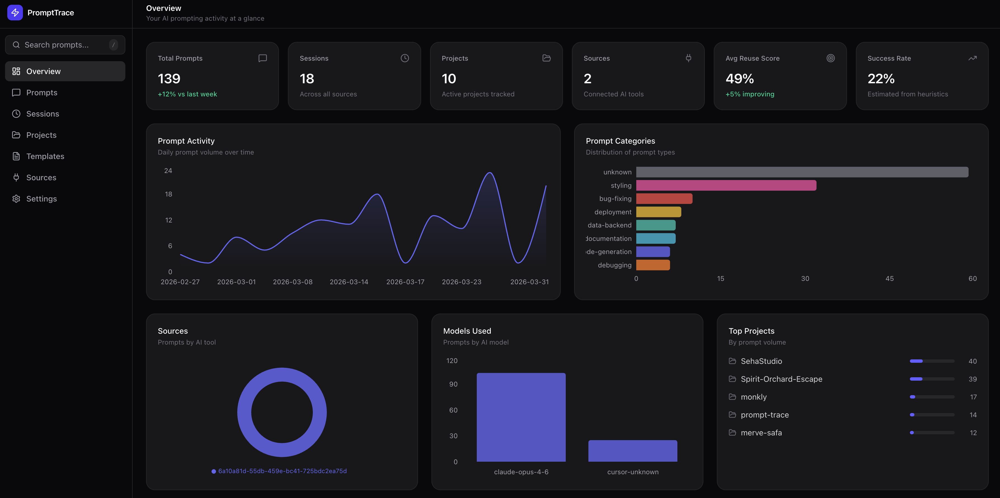

# PromptTrace

Local-first prompt optimization and reuse engine for AI-assisted development.

Scans your AI coding tool histories, classifies every prompt, scores quality, extracts reusable templates, detects workflow patterns, and gives you a dashboard to improve your prompting. All data stays on your machine.



## Quick Start

```bash
npx prompttrace
```

That's it. Opens your browser with the dashboard. First run takes ~60s to install dependencies and build. After that, starts in ~3s.

Also works with:

```bash
# yarn
yarn dlx prompttrace

# pnpm
pnpx prompttrace

# bunx
bunx prompttrace

# with custom port
npx prompttrace --port 4000

# scan only (no dashboard)
npx prompttrace scan

# skip auto-scan
npx prompttrace --no-scan
```

## What It Does

PromptTrace reads local history files from your AI coding tools, then:

1. **Classifies** every prompt into 14 categories and 8 intents
2. **Scores** each prompt on clarity, specificity, constraints, reusability, and success
3. **Extracts** reusable templates from similar prompt patterns
4. **Detects** workflow sequences (Prompt Packs) from repeated session patterns
5. **Generates** prompt standards from your most effective prompts
6. **Shows** everything in a local dashboard with search, filters, and charts

## Supported AI Tools

| Tool | Status | Data Location |
|------|--------|--------------|
| Claude Code | Working | `~/.claude/projects/` |
| Cursor | Working | `~/.cursor/projects/` |
| Codex CLI | Working | `~/.codex/sessions/` |
| VS Code (Copilot) | Working | `~/Library/Application Support/Code/` |
| Windsurf | Working | `~/Library/Application Support/Windsurf/` |
| Zed | Working | `~/Library/Application Support/Zed/` |
| Gemini CLI | Working | `~/.gemini/` |
| Copilot CLI | Working | `~/.copilot/` |
| Antigravity | Working | `~/Library/Application Support/Antigravity/` |
| Goose | Working | `~/.goose/` |
| Kiro | Working | `~/Library/Application Support/kiro/` |
| OpenCode | Working | `~/.opencode/` |
| Command Code | Working | `~/.commandcode/` |

13 adapters. Auto-detects which tools are installed on your machine.

## Dashboard Pages

| Page | What It Shows |
|------|--------------|
| **Overview** | Optimization opportunities, weak prompts, top templates, activity trends |
| **Library** | Searchable prompt library with quality/intent filters, weak/reusable badges |
| **Sessions** | AI interaction sessions as timelines |
| **Projects** | Per-project prompt patterns and stats |
| **Outcomes** | Prompt effectiveness: file changes, follow-ups, abandonment risk |
| **Templates** | Reusable prompt patterns with export, scoring, best examples |
| **Packs** | Detected workflow sequences (e.g., "Bug Triage Pack", "Refactor & Test Pack") |
| **Standards** | Best-practice prompt structures extracted from your most effective prompts |
| **Sources** | Connected AI tools, scan status, discovery |
| **Settings** | Database management, export, clear data |

## Prompt Analysis

Every prompt gets analyzed with 6 quality scores:

- **Clarity** - How clear and unambiguous the prompt is
- **Specificity** - How specific vs vague
- **Constraints** - Whether output boundaries are defined
- **Context Efficiency** - How well context is provided without noise
- **Ambiguity** - Single clear request vs multiple unfocused ones
- **Optimization** - Overall quality (weighted average)

Plus refactor suggestions: strengths, weaknesses, anti-patterns, improved version, template version.

## Tech Stack

| Layer | Technology |
|-------|-----------|
| Frontend | React 19, Vite, React Router, TanStack Query |
| Styling | Tailwind CSS 4, Recharts, Framer Motion |
| Backend | Express.js, TypeScript |
| Database | SQLite (better-sqlite3), Drizzle ORM |
| CLI | Node.js ESM |

## Privacy

100% local. No cloud, no accounts, no API keys, no telemetry. Data stored in `~/.prompttrace/data/prompttrace.db`. Open source under MIT.

## Development

```bash
git clone https://github.com/ahmetseha/prompt-trace.git
cd prompt-trace
npm install
npm run dev
```

Starts Vite dev server + Express API with hot reload.

## License

MIT
